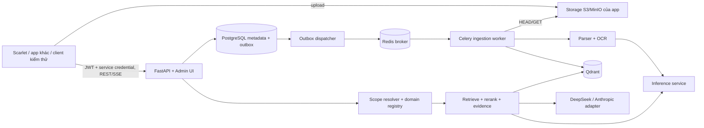

# RAG Core — Kế hoạch triển khai

> Trạng thái: kế hoạch đã được người dùng chấp thuận về phạm vi; chưa triển khai ứng dụng.
> Khởi tạo: 2026-09-15. Tài liệu dùng tiếng Việt; tên API, code và task ID dùng tiếng Anh.
> Nguồn thực thi: [tasks.md](tasks.md). Luật agent: [AGENTS.md](../AGENTS.md).

<a id="p00"></a>
## P00. Bối cảnh và các quyết định đã chốt

- Xây dựng RAG core độc lập, custom pipeline, để Scarlet và các app chat khác gọi qua API trong tương lai.
- Scarlet hiện có FastAPI, JWT, lịch sử chat trên PostgreSQL; đang dùng DeepSeek/Anthropic. Không sửa hay tích hợp Scarlet trong đợt triển khai này.
- RAG core trả câu trả lời hoàn chỉnh, trích dẫn và các đoạn truy xuất. App gọi có thể tiếp tục dùng LLM của app để diễn đạt lại.
- Phiên bản đầu: Default RAG, Document RAG, Multilingual RAG (EN/VI); thiết kế điểm mở rộng cho Technical/Custom Domain sau này.
- Local trước, Windows + Docker Desktop/WSL2, RAM 16 GB, RTX 4060 Laptop 8 GB VRAM. Tài liệu gốc dự kiến tổng khoảng <= 1 GB; 15–20 người dùng truy vấn đồng thời. Không có cam kết độ trễ cụ thể; phải đo và công bố.
- App sở hữu storage S3/MinIO và tài liệu gốc. App upload rồi thông báo RAG core qua API; không quét bucket tự động.
- RAG core sở hữu PostgreSQL metadata, Qdrant, hàng đợi và dữ liệu dẫn xuất của mình.
- Quyền dữ liệu tách theo ứng dụng + người dùng + session. Yêu cầu mới nhất của người dùng: **tài liệu ngoài session tuyệt đối không tham gia truy vấn**, kể cả của cùng người dùng.
- Xóa session chỉ vô hiệu hóa session và liên kết tài liệu; giữ tài liệu gốc và chỉ mục. Lịch sử hội thoại do app gửi, app chịu trách nhiệm lưu.
- Có UI quản trị local; không xây UI chat cho người dùng cuối.
- Thực thi prompt corpus tại [corpus-documents/Codex Prompt – Build RAG Evaluation Corpus.md](../corpus-documents/Codex%20Prompt%20%E2%80%93%20Build%20RAG%20Evaluation%20Corpus.md) trong phase corpus, không thực thi ở bước tạo tài liệu này.
- README và RUNBOOK phải được cập nhật trong từng task, song song với code. Mỗi task hoàn thành có Git commit.
- Các quyết định thiết kế dưới đây là baseline do agent thiết kế trong phạm vi đã được giao. Chỉnh yêu cầu, giảm DoD hoặc mâu thuẫn chưa giải quyết phải hỏi người dùng.

<a id="p01"></a>
## P01. Phạm vi và bất biến bắt buộc

### Bất biến phạm vi session

`effective_scope = authenticated_app ∩ authenticated_user ∩ active_session ∩ session_upload_bindings ∩ ready_document_versions ∩ requested_subset`

`requested_subset` vắng mặt chỉ có nghĩa lấy toàn bộ tài liệu hợp lệ **trong session**, không mở rộng ra kho người dùng. Danh sách rỗng, session rỗng và ID không hợp lệ có hành vi tường minh ở P06.

- Không tin `user_id`, `app_id`, danh sách quyền, URL storage hoặc vai trò do client tùy ý khai báo.
- Quyền kiểm tra trước truy xuất, trong mọi nhánh dense/sparse, trước rerank, mở rộng đoạn lân cận, dựng prompt, trả context và giải tham chiếu citation.
- Session mới không tự thừa hưởng tài liệu từ session cũ. Muốn dùng lại cùng file phải có upload/đăng ký nguồn cho session mới do backend ứng dụng xác nhận; dedup được phép tái sử dụng xử lý bên trong cùng chủ sở hữu.
- History, cache, prompt rewriting, admin preview và custom domain không được mở rộng phạm vi.
- Nguồn và history là dữ liệu không đáng tin về chỉ thị; không thực thi lệnh/URL/macro từ tài liệu.
- Admin xem metadata vận hành toàn hệ thống; không mặc nhiên có quyền đọc nội dung tài liệu của mọi người dùng.
- Không có chức năng xóa object gốc. Adapter storage chỉ có HEAD/GET; IAM cấp đọc theo phạm vi đã cấu hình.

### Trong phạm vi

REST/SSE, JWT/service authentication, session/document/job lifecycle, parsing/OCR, citation, EN/VI, domain registry, local Docker, admin UI, corpus, benchmark, observability, backup/restore và tài liệu tích hợp có thể kiểm chứng.

### Ngoài phạm vi

Sửa Scarlet; triển khai server/cloud; Kubernetes; billing; đăng nhập người dùng cuối; chia sẻ tài liệu giữa người dùng; web crawler; model training; GraphRAG; agent chạy tool từ tài liệu; audio/video; xử lý Office legacy `.doc/.xls/.ppt`; xóa bản gốc. Không tự thêm các chức năng này.

<a id="p02"></a>
## P02. Kiến trúc và tech stack



| Lớp | Lựa chọn ban đầu | Lý do / giới hạn |
| --- | --- | --- |
| Runtime | Python 3.12, uv, `pyproject.toml`, `uv.lock` | Tách nhóm API, ingestion, inference, dev; Docker là môi trường chuẩn |
| API | FastAPI, Pydantic v2, Uvicorn, HTTPX | REST, OpenAPI, async I/O; không chạy OCR/model trên event loop |
| Metadata | PostgreSQL 17, SQLAlchemy 2, Alembic | Transaction, migration, outbox, khóa/idempotency |
| Vector | Qdrant, qdrant-client | Dense + sparse, filter bắt buộc, collection theo index version |
| Jobs | Celery, Redis | Retry hữu hạn; PG là nguồn trạng thái bền vững, Redis không là sổ tài liệu |
| Storage client | boto3 sau `StorageReader` interface | Chỉ đọc nguồn; endpoint/bucket/prefix allowlist cấu hình phía server |
| Parsing | Docling + parser registry; openpyxl cho vị trí ô Excel | Giữ layout, nguồn; không xem hỗ trợ của thư viện là bằng chứng nghiệm thu |
| OCR | Tesseract CLI, tessdata `eng` + `vie` qua Docling | CPU mặc định cho OCR; không tải VLM OCR lớn ở bản đầu |
| Embedding | `BAAI/bge-m3` qua FlagEmbedding | Dense 1024 chiều + sparse lexical EN/VI; không dùng ColBERT ở bản đầu |
| Reranker | `BAAI/bge-reranker-v2-m3` | Query/passage scoring; score không là xác suất đúng |
| Generation | Adapter DeepSeek qua HTTPX; Anthropic SDK | Model ID/env độc lập, không mặc định hai provider có cùng schema |
| Admin UI | Jinja2, CSS, JavaScript ES modules phục vụ nội bộ | Không cần Node/build frontend; bảng metadata, polling, form có CSRF |
| QA | pytest, Ruff, mypy, pytest-asyncio, integration Docker, Playwright | Test theo rủi ro; không gọi mạng/LLM mặc định ở unit suite |
| Observability | JSON logs, request IDs, Prometheus metrics endpoint | Không dựng thêm hệ thống giám sát nặng trong Compose mặc định |

T01–T02 khóa patch versions và image digests tương thích, T17 khóa model revisions. Không dùng `latest`, không bịa phiên bản hoặc checksum. Model generation được người vận hành cấu hình bằng ID còn hoạt động lúc triển khai; không coi GPT dùng cho agent là LLM của RAG.

### Ngân sách tài nguyên

- Một API worker ban đầu; ingestion concurrency=1; một inference process dùng chung cho query và indexing, có ưu tiên query và giới hạn queue.
- CPU là đường chạy chức năng mặc định; GPU là Compose override đã kiểm chứng trên Docker Desktop/WSL2. FP16 chỉ dùng khi phần cứng hỗ trợ.
- Không khởi tạo bản sao embedding/reranker ở từng API/Celery worker. Cho phép nạp tuần tự/offload, giới hạn batch và token để tránh đồng thời giữ quá nhiều model.
- Mục tiêu kỹ thuật: phần Docker ổn định khoảng <= 10 GiB RAM để chừa tài nguyên Windows; VRAM <= 7 GiB khi chạy profile GPU. Đây là ngân sách cần đo, không là số đã đạt.
- <= 1 GB nguồn không có nghĩa <= 1 GB index; báo dung lượng nguồn, extracted text, vector, cache model và free disk riêng.
- Nếu không đạt ngân sách: giảm concurrency/batch và tối ưu bộ nhớ trong cùng kiến trúc; muốn đổi model hoặc dùng dịch vụ ngoài phải ghi quyết định và hỏi khi làm thay đổi phạm vi/DoD.

### Cấu trúc đích (chưa tồn tại)

```text
src/rag_core/{api,auth,config,domain,application,ports,adapters,workers,admin}/
src/rag_core/adapters/{storage,parsers,vector,models,llm,persistence}/
src/rag_core/admin/{templates,static}/
migrations/  tests/{unit,integration,contract,e2e,security,fixtures}/
scripts/  configs/  docker/  docs/  corpus-documents/
compose.yaml  compose.gpu.yaml  pyproject.toml  uv.lock  .env.example
```

Ports/interfaces không import FastAPI, Celery hoặc provider SDK. Core điều phối tường minh, không phụ thuộc một framework RAG lớn. Adapter được thay qua dependency injection/config.

<a id="p03"></a>
## P03. Domain registry và khả năng mở rộng

| `domain` | Tập tài liệu | Hành vi |
| --- | --- | --- |
| `default` | Toàn bộ tài liệu ready gắn với session | Hỏi đáp tổng quát; hỗ trợ multi-document trong session |
| `document` | `document_ids` không rỗng, là tập con session | Ưu tiên cấu trúc, bảng, vị trí trích dẫn |
| `multilingual` | Session, có thể thu hẹp bởi `document_ids` | EN/VI, `corpus_languages`, `answer_language`; tìm xuyên ngôn ngữ |

`bilingual` chỉ là nhãn dataset đánh giá; adapter eval ánh xạ sang API `multilingual`. Không tạo hai domain runtime đồng nghĩa. Technical và Custom Domain chưa có implementation.

Domain definition gồm ID/version, config schema, retrieval policy, chunking profile, query transformation, prompt template, evidence policy, citation renderer và evaluation profile. Registry khai báo tĩnh qua code/config đã tin cậy; không cho client upload Python hoặc prompt system tùy ý. Một domain mới đăng ký mà không sửa router trung tâm; có contract test với domain giả dùng trong test.

Scope resolver là bước bắt buộc nằm ngoài domain hook. Các hook chỉ nhận `ScopedRetrievalContext` đã xác thực; mọi truy cập repository vẫn ép scope. Model/index/chunker version thuộc index fingerprint, không tự ghi đè index cũ khi đổi domain config.

<a id="p04"></a>
## P04. Dữ liệu, storage và vòng đời

### Thực thể

- `Application`: app ID, cấu hình JWT issuer/audience/JWKS, reference service secret và storage allowlist; secret không nằm trong response admin.
- `Principal`: `(app_id, subject)` từ auth; không tạo hệ thống tài khoản người dùng cuối.
- `Session`: UUID, external_session_id, owner, status `active/deleted`, `scope_revision`; external ID chỉ unique trong app+owner.
- `Document`: UUID, owner, tên hiển thị, source reference; không suy quyền chỉ từ bucket/key.
- `DocumentVersion`: source version ID/SHA-256, loại file, kích thước, extraction/index fingerprint, active ready generation.
- `SessionDocument`: session + document version + upload registration ID, thời điểm, trạng thái `attached/detached`; unique constraint chặn duplicate.
- `IngestionJob`: state/progress/error/retry, lease, task fingerprint; `OutboxEvent` để phát job sau transaction.
- `Chunk`: ID ổn định, document/version/generation, text, language, source locator, checksum. Nội dung dẫn xuất được lưu bền trong PostgreSQL với giới hạn; không lưu bản sao toàn bộ binary gốc.
- `AdminSession`, `AuditEvent`: quản trị local và nhật ký hành động metadata.

Qdrant payload tối thiểu: `app_id`, `owner_id`, `document_id`, `document_version_id`, `index_generation`, `chunk_id`, `language`, locator. PG giữ quan hệ session thay vì nhân vector theo session. Scope resolver lấy các cặp version/generation được phép từ PG và đưa vào **mọi filter truy xuất**: app/owner AND (cặp version+generation A OR cặp B...). Không lọc hai danh sách version/generation độc lập tạo tích chéo ngoài quyền.

### Upload và ingestion

1. App upload nguồn vào storage riêng và kiểm tra quyền người dùng đối với object.
2. App backend gọi create session nếu cần, rồi register upload với service credential + user JWT.
3. RAG core đối chiếu app storage config, subject, session; HEAD/GET bounded, kiểm version/checksum; ghi registration + job + outbox theo transaction.
4. Worker đọc nguồn, parse/OCR, chunk, embed, ghi generation mới, kiểm count/hash.
5. Chỉ công bố `ready` generation trong PG sau khi các phần bắt buộc thành công. Query chỉ lấy generation đã công bố; dọn generation lỗi/cũ bằng tác vụ nội bộ có phạm vi.
6. Nếu source đổi giữa HEAD/GET: dùng versioned GET hoặc checksum precondition; phát lỗi `source_changed`, không trộn hai phiên bản.

Định danh idempotency có app+owner+session+request hash. Cùng key và body trả cùng kết quả; cùng key khác body trả 409. Dedup xử lý dựa owner+content+pipeline fingerprint, không tiết lộ file tồn tại của người dùng khác. Version mới cần registration/link mới; không âm thầm thay evidence của session đang dùng version cũ.

### Lifecycle

- Job: `queued -> fetching -> parsing -> chunking -> embedding -> indexing -> ready`; trạng thái kết thúc khác `failed/cancelled`. Retry có backoff, max attempts, lỗi phân loại.
- Xóa session: tombstone, tăng scope revision, vô hiệu liên kết, chặn query mới; không xóa nguồn/chunks/vector. Repeated delete trả kết quả idempotent cho đúng chủ sở hữu.
- Detach tài liệu: tăng scope revision; ảnh hưởng session hiện tại, không session khác. Không tự gắn lại khi job hoàn tất.
- Job đang chạy có thể kết thúc tạo chỉ mục được giữ lại; không hồi sinh session đã xóa. Việc hủy job không cấp quyền trở lại.
- Giữ chỉ mục vô thời hạn ở bản đầu, hiển thị dung lượng. Chưa có auto-purge theo việc xóa chat, cũng không có admin purge nguồn.
- Reindex giữ generation cũ hoạt động đến khi generation mới được công bố đầy đủ. Xóa derivative tạm lỗi phải giới hạn owner/version/generation cụ thể.

<a id="p05"></a>
## P05. Xác thực và ranh giới tin cậy

- API nghiệp vụ là backend-to-backend. `Authorization: Bearer <user-JWT>` xác định subject; `X-RAG-Service-Key` ánh xạ app đã đăng ký. Không chuyển service key đến frontend/browser của app chat.
- Xác thực chữ ký JWT với thuật toán allowlist (RS256 cho local fixture), issuer, audience, expiration, nbf và key rotation/JWKS cache hữu hạn. Không chỉ decode token.
- Đường JWKS do cấu hình app xác định, không lấy URL tùy ý từ token. Thiếu hoặc sai auth thì fail closed.
- Local issuer/token CLI dùng key dev tự tạo, không dùng secret cố định commit vào Git. Không tắt auth mặc định để tiện demo.
- Endpoint registration chỉ dành cho trusted app backend: service key chứng minh app; backend app chịu trách nhiệm chứng thực object đã được upload cho subject/session. RAG core kiểm cấu hình prefix, owner/session, không thể tự suy ra quyền object của app từ tên file.
- 404 cho resource ngoài quyền để không tiết lộ tồn tại; 401 invalid credentials, 403 role/scope không đủ với chức năng đã biết.
- Admin dùng login riêng với password hash từ env/secret; cookie HttpOnly, SameSite, thời hạn, CSRF. `Secure` bật khi HTTPS; HTTP loopback local được cấu hình rõ.
- Admin chỉ metadata mặc định; không xem raw text, prompts, answers, bucket credentials hoặc presigned URL. Chức năng thử query dùng principal kiểm thử riêng qua API chuẩn.
- Rate limit theo app+owner, request/body limits, giới hạn history, log redaction. Nội dung tài liệu không được ghi vào logs/metrics mặc định.

<a id="p06"></a>
## P06. Hợp đồng API v1

Các endpoint dưới đây là **thiết kế mục tiêu**, chỉ đánh dấu hoạt động trong RUNBOOK sau task tương ứng PASS. Schema Pydantic/OpenAPI là nguồn máy đọc được từ T03.

| Method / path | Mục đích |
| --- | --- |
| `POST /v1/sessions` | Tạo/resolve session cho external_session_id trong đúng principal |
| `GET /v1/sessions/{session_id}` | Metadata + scope revision của session được phép |
| `DELETE /v1/sessions/{session_id}` | Tombstone session; giữ nguồn và index |
| `POST /v1/sessions/{session_id}/documents` | Register upload object, gắn session, enqueue; 202 + document/job |
| `GET /v1/sessions/{session_id}/documents` | Chỉ các link của session; phân trang |
| `DELETE /v1/sessions/{session_id}/documents/{document_id}` | Detach link, không xóa bản gốc/index |
| `GET /v1/jobs/{job_id}` | Status/progress/error của owner |
| `POST /v1/jobs/{job_id}/retry` | Retry lỗi cho phép, idempotent, không hồi sinh link |
| `POST /v1/query` | Câu trả lời hoàn chỉnh + evidence JSON |
| `POST /v1/query/stream` | Cùng request schema, SSE stream |
| `GET /v1/sessions/{session_id}/citations/{chunk_id}` | Resolve nguồn trong current scope; không trả URL công khai |
| `GET /health/live`, `GET /health/ready` | Liveness / readiness, không lộ secrets |
| `GET /metrics`, `/admin/*`, `/v1/admin/*` | Vận hành có bảo vệ, theo P10/P12 |

Không có endpoint public liệt kê toàn bộ kho user để truy vấn, upload binary vào RAG core, xóa nguồn, hoặc arbitrary vector search.

### Request mẫu (thiết kế)

```json
{
  "session_id": "uuid",
  "domain": "multilingual",
  "question": "Doanh thu tăng như thế nào?",
  "document_ids": ["uuid"],
  "history": [{"role": "user", "content": "Tôi đang đọc báo cáo năm 2023."}],
  "corpus_languages": ["en"],
  "answer_language": "vi"
}
```

- `session_id` và `question` bắt buộc; `domain` mặc định `default` nếu vắng mặt. Default không nhận subset; Document bắt buộc nonempty `document_ids`; Multilingual có thể có subset. Client truyền `[]` là lỗi 422, không nghĩa all.
- History chỉ role `user/assistant`; cấm client đặt system/developer. Giới hạn số lượt/token, cắt có thông báo trong metadata; không lưu transcript mặc định.
- ID ngoài session trả 404; không âm thầm bỏ ID rồi tiếp tục trên tập khác. Session deleted trả 410 cho owner. Session không có tài liệu attached trả `no_session_documents` (409).
- Nếu có tài liệu selected chưa ready: 409 `documents_not_ready`; không trả câu trả lời dựa một phần mà không biết. Tài liệu lỗi cần retry/detach hoặc chọn subset ready rõ ràng.
- Không có passage đủ bằng chứng sau truy xuất hợp lệ: HTTP 200 + `answerability=insufficient_evidence`; không dùng trạng thái này để che lỗi dịch vụ.
- Limits khởi tạo: tối đa 50 documents/session, 100 MiB/file, 1.000 trang/file, history 20 messages/8.000 tokens, question 4.000 ký tự, context 8.000 tokens, output 1.024 tokens. Là config có test boundary; báo rõ chưa hỗ trợ file vượt hạn.

### Response và lỗi

```json
{
  "request_id": "uuid",
  "session_id": "uuid",
  "scope_revision": 3,
  "domain": "multilingual",
  "answer": "... [c1]",
  "answerability": "supported",
  "reason_code": null,
  "citations": [{"id": "c1", "document_id": "uuid", "version_id": "uuid", "chunk_id": "stable-id", "filename": "report.pdf", "locator": {"kind": "pdf", "page": 12}, "quote": "..."}],
  "contexts": [{"chunk_id": "stable-id", "document_id": "uuid", "text": "...", "citation_ids": ["c1"]}],
  "usage": {"provider": "configured-provider", "model": "configured-id", "input_tokens": 0, "output_tokens": 0},
  "timings_ms": {"retrieval": 0, "generation": 0, "total": 0},
  "warnings": []
}
```

Token/timing chưa được provider cung cấp dùng `null`, không bịa 0 thực tế; số 0 trên chỉ minh họa kiểu. Error envelope: `error.code`, `error.message`, `error.retryable`, `request_id`, details đã redacted. 429 busy/rate limit + Retry-After; 502 provider error; 503 dependency unavailable; 504 timeout; 409 idempotency/scope conflict; 422 input invalid. Không trả stack trace cho client.

<a id="p07"></a>
## P07. Parsing, OCR và chunking

| Định dạng nghiệm thu | Locator bắt buộc | Lưu ý |
| --- | --- | --- |
| PDF text / scan / mixed | PDF physical page one-based, block/offset nếu có | OCR từng trang cần thiết, không ghép trùng text layer và OCR |
| DOCX | heading path + paragraph/table index | Không bịa số trang vì reflow |
| XLSX | sheet + cell range, header/unit context | Không chạy formula/macro; phân biệt formula và cached value chưa có |
| PPTX | slide one-based + shape/block | Text và bảng; không cam kết hiểu biểu đồ/hình phức tạp |
| TXT, Markdown | line/paragraph + offsets | UTF-8, dấu tiếng Việt, heading context |
| CSV | row range + column/header | Encoding/delimiter validation, giữ đơn vị |
| HTML | heading/block | Bỏ scripts, không fetch link/subresource |
| PNG/JPEG | image ID + OCR block/bbox nếu có | OCR eng/vie; không suy diễn nội dung hình ngoài text |

Parser registry phát hiện MIME thực + extension allowlist. File hỏng, encrypted, quá lớn, archive bomb, parser timeout đều có lỗi rõ. Tệp Office là ZIP: giới hạn số entry và expanded size, không giải nén tùy ý ra workspace. Temporary files nằm trong worker sandbox, cleanup kể cả exception; không thực thi macro, external relationship hoặc công thức.

Chuẩn trung gian `ParsedDocument/Block/SourceLocator` giữ provenance. Bảng phải giữ tiêu đề cột, header và đơn vị khi chia đoạn; split row groups, không cắt ô tùy ý. Chunking khởi tạo 512 embedding tokens, overlap 64, theo biên heading/paragraph, ghi chunker/tokenizer revision; giới hạn phải tính bằng tokenizer thật. Đo trên corpus rồi tune ở task được giao.

Citation PDF dùng trang vật lý one-based; nhãn trang in trong PDF là field tùy chọn khác. FinanceBench ground truth zero-based giữ nguyên, chuyển ở adapter eval. XLSX/DOCX không có trang thì dùng locator tương ứng. OCR không đọc được phải báo extraction quality/failed, không giả vờ tài liệu rỗng là ingestion thành công.

<a id="p08"></a>
## P08. Truy xuất và câu hỏi nối tiếp

1. Authenticate, validate, resolve immutable scope snapshot và revision.
2. Dùng history có giới hạn để rewrite câu hỏi độc lập nếu cần; history không phải nguồn bằng chứng. Các citations/đoạn context cũ chỉ được dùng khi xác minh vẫn thuộc current scope; nếu không xác minh được thì loại khỏi evidence.
3. Dense + sparse BGE-M3; tất cả prefetch/neighbor lookup đều có cùng owner + allowed versions/generations + language filter.
4. Fuse bằng RRF, khởi tạo top 30 mỗi nhánh, rerank tối đa 20, chọn tối đa 8 passages trong token budget. Không coi RRF score là confidence.
5. Mở rộng bằng chứng lân cận khi cần trong đúng version/page/section và scope; giữ budget, không kéo cả document vào prompt.
6. Evidence policy xác định đủ/thiếu support; threshold được hiệu chỉnh trên tuning split và khóa trước held-out eval. Không chỉ dựa một similarity score cố định cho mọi domain.
7. Revalidate session revision trước generation/trả kết quả; query không được tiếp tục với scope đã bị detach/delete mà chưa kiểm lại.

Default hỗ trợ nhiều tài liệu cùng session để xử lý bridge/comparison. Không hứa multi-hop chỉ nhờ top-k; dùng corpus để kiểm tra, bounded second retrieval là hook có budget nếu T31 cần, không tự bật agent tool search.

Multilingual mặc định trả theo ngôn ngữ câu hỏi, trừ khi có `answer_language`. `corpus_languages` thu hẹp phạm vi; tuyệt đối không tìm corpus cùng ngôn ngữ câu hỏi khi evaluation slice yêu cầu ngôn ngữ đối diện. Không cần dịch toàn bộ kho để hoạt động.

Chưa bật response/retrieval cache dùng chung ở bản đầu. Nếu task hiệu năng thêm cache, key phải chứa app, owner, session, scope revision, versions, domain/config, normalized query/history, language và model revision; revalidate trước hit. Embedding cache của nội dung riêng vẫn phải cách ly owner.

<a id="p09"></a>
## P09. Generation, citations và SSE

- Cùng interface `generate/stream`, timeout, bounded retry có jitter, cancellation, usage chuẩn hóa cho hai provider. Không tự đổi provider giữa stream; không retry sau khi đã phát answer delta làm lặp câu.
- Prompt tách system policy, user/history và evidence; tài liệu không có quyền đổi chỉ thị hoặc gọi tools. Không đưa API keys hoặc storage credentials vào prompt.
- `answerability=supported|insufficient_evidence`; reason code như `no_relevant_evidence`, `conflicting_evidence`. Khi thiếu: LLM diễn đạt sự thiếu thông tin tự nhiên, có thể xin chi tiết; không dùng kiến thức ngoài để lấp factual answer. Lỗi LLM là lỗi kỹ thuật, không đóng giả thành thiếu bằng chứng.
- Citation IDs do core cấp từ evidence allowlist; model chỉ tham chiếu ID đó. Validate ID, owner, version, quote/offset/locator. Có repair tối đa một lần có giới hạn; vẫn sai thì trả lỗi `invalid_citation`, không phát `done` hợp lệ.
- Câu trả lời supported phải có citation hợp lệ; contexts chỉ gồm evidence được phép và cần cho app gọi tiếp. Thiếu bằng chứng không tạo citation giả; context rỗng nếu không có nguồn phù hợp.
- Khi app viết lại answer, RUNBOOK yêu cầu giữ evidence IDs, không coi câu trả lời do app viết lại đã được core kiểm chứng.

### Giao thức SSE

`POST /v1/query/stream`, `text/event-stream`, HTTPX/fetch client (EventSource native không hỗ trợ POST + Authorization đầy đủ).

Events theo thứ tự: `meta` (request/scope), `evidence` (citations + contexts + answerability), `answer_delta` (text), rồi đúng một trong `done` (final JSON đã validate) hoặc `error`. Có heartbeat comment; event IDs tăng dần trong request, không hứa replay bằng Last-Event-ID.

Delta là bản tạm; client chỉ lưu câu trả lời hoàn chỉnh khi nhận `done`. Core buffer theo câu/đoạn để kiểm citation ID trước phát; nội dung streaming vẫn phải được audit/validate ở final. Stream lỗi giữa chừng phải đánh dấu incomplete ở client, không ráp thành answer thành công.

Kiểm revision trước event evidence và từng batch delta; khi session bị detach/delete thì dừng, `error.code=session_scope_changed`. Bytes đã gửi không thể thu hồi; không gửi thêm evidence của scope cũ sau khi phát hiện thay đổi. Kiểm trước final `done`; HTTP JSON revalidate trước serialize. Ghi rõ giới hạn giao thức này trong RUNBOOK.

Disconnect hủy HTTP upstream và giải semaphore/job query; query không là Celery ingestion job. Timeout/rate-limit/queue bounded không để RAM tăng vô hạn.

<a id="p10"></a>
## P10. UI quản trị

UI `/admin`, cùng Docker image API, thiết kế desktop rõ ràng, đáp ứng màn hình nhỏ, điều hướng bàn phím, loading/empty/error states và xác nhận cho retry/reindex có tác động.

| Màn hình | Nội dung / hành động |
| --- | --- |
| Login | Admin credential riêng, logout, hết hạn phiên |
| Overview | Dependency health, job counts, queue depth, lỗi, tài nguyên đo được |
| Documents | Metadata có phân trang/lọc app, owner, format, trạng thái; không hiển thị nội dung |
| Jobs | Progress, error code đã redacted, retry/cancel hợp lệ |
| Sessions | Metadata session và link, tombstone/detach theo API admin có audit |
| Index / models | Revision, dimension, generation, dung lượng; reindex qua job, không sửa tùy ý Qdrant |
| Evaluations | Đọc manifest/báo cáo eval đã chạy, phân biệt mock/real; không có nút chạy full LLM tốn phí ngầm |

Mọi hành động có role check phía server, CSRF khi cookie auth, audit actor/action/target/request ID. Không có trình xem secrets, arbitrary SQL, arbitrary file browser hoặc nút xóa object gốc. Nội dung tên file/error được escape chống XSS. API admin không là đường vòng để truy vấn tài liệu ngoài session.

<a id="p11"></a>
## P11. Corpus và đánh giá

Prompt corpus của người dùng là đặc tả bắt buộc cho phase corpus. Các quy định “không đổi retrieval/model/API” trong prompt áp dụng riêng task chuẩn bị corpus; không cấm triển khai pipeline ở phase khác.

| Bộ dữ liệu | Sản phẩm bắt buộc |
| --- | --- |
| HotpotQA official dev distractor | 100 QA deterministic seed 42; stratify bridge/comparison và medium/hard theo phân bố thực; materialize context paragraphs gồm distractors, dedup; gold docs chỉ từ supporting facts |
| FinanceBench official open source | Toàn bộ open-source QA (dự kiến 150), PDF thực sự được reference, evidence/answer gốc; page convention zero-based trong manifest |
| XQuAD official EN/VI | Toàn bộ paragraphs và QA gốc sau kiểm alignment (dự kiến 240 paragraph/language, 1190 QA/slice), đủ en_en, vi_vi, vi_en, en_vi; không thay full dataset bằng subset |

Một command: `python corpus-documents/scripts/setup_corpus.py --all`; hỗ trợ `--domain`; idempotent, resumable, checksum, source revision/download timestamp/license/actual counts, fail nonzero khi invalid. Không tải baseline training dependencies. Raw/PDF/model cache không commit; scripts, manifest nhẹ và attribution được commit theo license. Download chỉ official upstream; hết nguồn thì báo blocker, không bịa dữ liệu.

Ground truth không đi vào ingestion: ingest riêng `documents/`; `qa/`, answer, justification, supporting facts chỉ evaluator đọc. Source question IDs trong metadata không dùng làm retrieval text/filter để biết trước đáp án. FinanceBench document selection được phép ở Document RAG vì người dùng biết tài liệu đã chọn; không lọc sẵn trang evidence. HotpotQA tìm trong corpus materialized, không chỉ gold docs của từng câu. Cross-lingual filter enforce corpus language thật.

**Ngoại lệ nguồn T05 được người dùng phê duyệt ngày 2026-09-17:** sau bounded GET official CMU HTTP/HTTPS đều timeout, user trả lời “Cho phép bản Hugging Face (đề xuất)” cho `hotpotqa/hotpot_qa`, `distractor/validation`, revision `1908d6afbbead072334abe2965f91bd2709910ab`. Chỉ file `distractor/validation-00000-of-00001.parquet`, published SHA256 `c20b638ca82b21d04fe12e14ff417ad05153d4d215a65de54497fca4e972f7c6` / 27,452,575 bytes. Đây là community/HF-maintained derivative, không claim official author mirror hoặc byte-identical CMU JSON. Verify actual bytes và bảo toàn semantic fields khi chuyển `id/context/supporting_facts`; ghi revision/checksum/conversion/license/attribution/actual distribution và giới hạn chưa đối chiếu CMU. Target100/seed42/gold/supporting-only/distractors/DoD giữ nguyên; không mở arbitrary mirror override. Prompt corpus gốc nguyên byte. Quyết định và evidence tại [H-T05-A02](handoffs.md#h-t05-a02).

### Evaluation harness

- Bộ fixtures chức năng riêng: scan EN/VI, bảng, unanswerable, prompt injection, 2 users/2 apps/2 sessions cùng owner, detach/delete trong stream. Fixture synthetic phải gắn nhãn, không thay official gold.
- Dataset `bilingual` ánh xạ `multilingual`; `answer_language` khớp ngôn ngữ gold ở cross-lingual slice, dù default sản phẩm trả theo câu hỏi.
- Split tuning/held-out deterministic theo document/parallel group, tránh QA cùng evidence rơi hai phía; lưu split IDs trước tune.
- Dense baseline, hybrid, hybrid+reranker; retrieval Recall@5/10, MRR/nDCG, supporting document recall và page/locator recall. Full normalized QA chạy retrieval; generation benchmark dùng deterministic sample tối thiểu 20 Default, 30 Document, 20 mỗi slice EN/VI (130 câu), lưu IDs và lý do giới hạn chi phí/thời gian.
- Answer EM/F1 có chuẩn hóa EN/VI nhưng không xóa ý nghĩa số/đơn vị; numeric accuracy/tolerance theo câu hỏi; citation validity, citation evidence support, faithfulness. LLM judge chỉ metric bổ sung, lưu model/prompt/revision, không thay gold bằng đáp án judge tạo.
- XQuAD không có unanswerable; báo riêng bộ kiểm thiếu bằng chứng, không suy kết quả chống hallucination từ XQuAD.
- Không đặt điểm benchmark chưa đo. Gate: fixtures an toàn/phạm vi pass 100%; invalid/out-of-scope citations 0; cấu hình cuối trên held-out Recall@10 mỗi slice không giảm > 2 điểm phần trăm so dense baseline. Nếu hybrid/rerank làm giảm vượt ngưỡng thì sửa/tune trên tuning split, không hạ gate hoặc tune held-out.
- Nếu cấu hình cuối không vượt baseline về chất lượng, báo trung thực và chọn cấu hình theo đánh đổi đã đo trong domain config; luôn giữ code path hybrid/rerank và test. “Tốt” phải có báo cáo, không chỉ demo một câu hỏi.

<a id="p12"></a>
## P12. Docker, vận hành và tài nguyên

- Compose: `api`, `worker`, `dispatcher`, `inference`, `postgres`, `qdrant`, `redis`; MinIO + bootstrap upload fixture là profile `local-storage` để mô phỏng app.
- Docker Linux containers, named volumes cho PG/Qdrant/MinIO/model cache. Không bind mount database files vào NTFS; repo bind mount chỉ dev code khi cần.
- API publish `127.0.0.1:8000`; MinIO dev console loopback nếu bật; database/broker/inference không publish mặc định. Không tự bật firewall/tunnel/hosting.
- Separate build stages/dependency groups; API image không chứa model/OCR dependencies nếu không cần; cache revisions có manifest, download rõ ràng.
- Healthcheck phân biệt process alive và dependencies ready; API readiness không đánh đồng LLM trả lời tốt; provider live probe riêng và có hạn mức.
- Migration chạy bằng command riêng, không để nhiều worker cùng migrate. PG constraints và transactional outbox bảo đảm job không mất khi broker restart.
- Persistent restart test; ingestion retry/resume sau worker kill; source/version/index consistency; orphan generation cleanup scoped.
- Backup PostgreSQL + Qdrant snapshot + config/revision manifests nhất quán bằng maintenance/write pause; app chịu backup storage gốc. Restore trong Compose project/volumes tách biệt, kiểm citations và scope, không đè môi trường đang dùng.
- Log JSON: request/job/task ID, stage latency, error code; metrics labels low-cardinality (không user ID/query text). Redact JWT, service key, presigned signatures, nội dung tài liệu.
- Không mặc định `docker compose down -v`. Thao tác xóa volume cần yêu cầu rõ; RUNBOOK ưu tiên stop/start và restore sang môi trường mới.
- Load test 15 và 20 virtual users, gồm query streaming/nonstream và ingestion nền; công bố concurrency, offered/admitted/rejected, p50/p95 TTFT/total, timeout/error, queue, RAM/VRAM. Không gọi TTFT của `meta` là token đầu của câu trả lời.

<a id="p13"></a>
## P13. Chiến lược kiểm chứng và Definition of Done chung

Mỗi task có DoD riêng trong tasks.md và kế thừa D1–D6 dưới đây. Output thật, lệnh/cwd/exit code/fixture/model/config phải lưu handoffs; log dài có artifact đã redacted + excerpt thật. Không ghi PASS cho bước skip, chưa chạy hoặc mock thay real.

- **D1 — Scope:** `git diff --check`; kiểm changed files so với task, không sửa ngoài phạm vi, đọc dependency implementation notes.
- **D2 — Quality:** chạy checks áp dụng cho file thay đổi (Ruff/mypy/pytest marker phù hợp); test nghiệp vụ trọng yếu, không viết test chỉ mirror implementation.
- **D3 — Task DoD:** chạy từng dòng nghiệm thu riêng, ghi expected/actual và exit code; DoD manual phải có bằng chứng quan sát thật. Bước cần service/credential mà chưa có là BLOCKED.
- **D4 — Docs:** cập nhật README + RUNBOOK theo thay đổi; nếu không ảnh hưởng ghi lý do dưới task. Cập nhật task execution notes, handoffs và implementation-summary.
- **D5 — Review:** xem diff, không secrets/raw licensed corpus/weights/cache; migrations/schema/contract breaking change phải có kế hoạch chuyển đổi.
- **D6 — Commit:** stage đúng file task, commit với task ID; kiểm commit có đủ code/test/docs và không chứa file người dùng ngoài phạm vi. Commit fail thì chưa COMPLETE.

T00 là task tài liệu: quality check là UTF-8, links/anchors, trạng thái/task field/dependency nhất quán; không dựng ứng dụng, không chạy pytest/LLM. Các task code dùng marker chung `unit`, `integration`, `contract`, `e2e`, `security`, `live`, `slow`; live chỉ chạy có chủ đích.

Local acceptance cuối: pipeline thật với storage/Qdrant/OCR/models, provider smoke thật cho cả DeepSeek/Anthropic, admin UI thực, full corpus validation, retrieval eval đầy đủ, generation sample, session isolation suite, load 15–20 users, restore rehearsal và integration example độc lập. Không gọi đã tích hợp Scarlet khi mới thử client mẫu.

<a id="p14"></a>
## P14. Orchestrator và task workflow

### Vai trò

- Orchestrator chạy **GPT-6-Astra**: chỉ đọc, lập kế hoạch, chọn task, spawn/wait/review. Không viết code, script, test, config hoặc sửa file bằng shell. Việc ghi kế hoạch/nhật ký vào repo cũng giao worker để giữ một người ghi.
- Worker **GPT-5.6-Sol**, effort **xhigh**, context mới cho **mỗi task và mỗi retry**. Không tái sử dụng worker, không fork toàn bộ hội thoại, không spawn agent cháu.
- Tại mọi thời điểm chỉ **một worker hoạt động**. Sau báo cáo kết thúc, kiểm agent đã dừng trước task sau. Các phép async I/O nội bộ sản phẩm không liên quan quy tắc tuần tự agent.
- Nếu runtime có tool như phiên lập kế hoạch này: `spawn_agent` với `model="gpt-5.6-sol"`, `reasoning_effort="xhigh"`, `fork_turns="none"`; nội dung prompt phải tự đủ bối cảnh. Đây là tham số tool của môi trường hiện tại, không phải lệnh CLI phổ quát.
- Runtime phiên mới phải xác nhận hỗ trợ đúng model/effort/context isolation và thu hồi slot của agent đã kết thúc. Không có khả năng này thì báo blocker; không dùng model gần tên hoặc để root tự code.

### Drain tuần tự

1. Đọc AGENTS, tasks, handoffs, implementation-summary; đối chiếu Git worktree và commit task trước.
2. Chọn task IN_PROGRESS/BLOCKED cần phục hồi trước; nếu không, task TODO nhỏ nhất mà dependencies COMPLETE.
3. Giao worker task ID, attempt ID, mục tiêu, allowed files, dependency IDs, plan anchors, D1–D6 và DoD task, baseline dirty files, chỉ dẫn ghi tài liệu/commit.
4. Worker đọc các nguồn trên từ disk, đánh dấu IN_PROGRESS, thực hiện đúng task; chỗ chưa rõ/mâu thuẫn báo lại, không đoán.
5. Worker chạy DoD, cập nhật docs, tạo commit, trả files, actual evidence, commit hash, risks/blockers và trạng thái.
6. Orchestrator đọc diff/evidence/commit để chấp nhận; không tin dòng “done” khi thiếu bằng chứng. Nếu cần sửa, lập phương án trong phạm vi task và spawn worker mới cho cùng ID, attempt tăng.
7. Failed/blocked attempt phải ghi nguyên nhân, reproduction, lệnh thất bại và thay đổi còn dở trước khi kết thúc. Không chuyển task phụ thuộc sang chạy.
8. Tối đa 3 attempts cho cùng blocker không có tiến triển; cần credentials/permission/quyết định sản phẩm thì hỏi ngay khi biết, không lặp vô ích. Orchestrator tự giải lỗi kỹ thuật trong phạm vi đã duyệt; không đoán yêu cầu sản phẩm.
9. Khi context/slot hạn chế: yêu cầu worker đang hoạt động ghi checkpoint, kết thúc; bàn giao session Orchestrator mới. Không gọi drain hoàn tất nếu còn TODO/BLOCKED.
10. Kết thúc chỉ khi mọi task COMPLETE và final acceptance có bằng chứng; báo hash các task cuối, lệnh chạy, giới hạn thực tế.

### Git và trạng thái

`TODO -> IN_PROGRESS -> COMPLETE`, hoặc `IN_PROGRESS -> BLOCKED -> IN_PROGRESS` với worker mới. COMPLETE chỉ sau DoD + docs + commit. Trạng thái COMPLETE trong nội dung commit là đề nghị đóng task; hợp lệ khi commit thành công và Orchestrator kiểm.

Commit format `feat(Txx): ...`, `test(Txx): ...`, `docs(Txx): ...`; checkpoint lỗi `chore(Txx): checkpoint attempt N`, không là completion commit. Không amend/rewrite lịch sử task đã nghiệm thu, không push/merge khi chưa được yêu cầu.

Hash commit không thể ghi vào chính nó. Task ghi commit subject/Task-ID để resolve bằng `git log`, worker trả hash sau commit; worker task kế tiếp ghi hash task trước vào handoff nếu cần. Không tạo vòng lặp amend chỉ để nhét hash.

<a id="p15"></a>
## P15. Tài liệu sống và tích hợp tương lai

| File | Vai trò |
| --- | --- |
| `AGENTS.md` | Luật bắt buộc, ranh giới vai trò, safety/scope, quy trình task |
| `docs/plan.md` | Bối cảnh, thiết kế, quyết định, scope và links nguồn |
| `docs/tasks.md` | Backlog có thứ tự, dependency, plan refs, công việc, DoD, pitfalls, execution notes |
| `docs/handoffs.md` | Điểm vào session tiếp theo + bằng chứng lệnh thật + blockers |
| `docs/implementation-summary.md` | Ghi chú thực thi theo phase/task, interfaces, decisions, limitations |
| `README.md` | Trạng thái thật, giới thiệu, quickstart đã kiểm, đường dẫn |
| `RUNBOOK.md` | Setup/ops/troubleshooting + hợp đồng tích hợp app độc lập đầy đủ |

Trong từng task, cập nhật hai file gốc cùng lúc với phần tính năng tương ứng; không đợi cuối dự án. Không ghi command chưa tồn tại như đã chạy được. Phân biệt `DESIGNED`, `IMPLEMENTED`, `VERIFIED`, ghi task/commit chứng minh.

RUNBOOK cuối phải có: source-of-truth ownership, auth/JWKS/app config, S3 upload registration, session mapping, API schemas/examples/error/status, retry/idempotency, SSE parser/cancel, history/token budget, language selection, citations khi app rewrite answer, deletion/retention, timeouts/rate limits, metrics/redaction, schema/index migration, backup/restore, Docker Windows/GPU, tests/corpus/eval, checklist tích hợp Scarlet và client FastAPI/HTTPX độc lập đã chạy thật.

Khi sau này tích hợp Scarlet, agent không được dùng session_id hoặc document_ids phía browser mà bỏ kiểm user ownership ở backend. Không dùng PostgreSQL chat của Scarlet như database riêng của core. Không import code core trực tiếp vào Scarlet để thay cho hợp đồng HTTP.

<a id="p16"></a>
## P16. Phases, rủi ro và kết thúc

| Phase | Tasks | Kết quả |
| --- | --- | --- |
| 0. Hồ sơ và nền tảng | T00–T03 | Tài liệu, Python/checks, Docker nền, schema API |
| 1. Evaluation corpus | T04–T08 | Official data tải/chuẩn hóa/validate có thể tái tạo |
| 2. Identity và lifecycle | T09–T12 | JWT, metadata/session scope, storage, registration/outbox |
| 3. Ingestion và index | T13–T19 | Parsers/OCR/chunking/models/Qdrant/jobs thật |
| 4. Retrieval và domains | T20–T22 | Registry/history, hybrid, rerank/evidence |
| 5. Generation và API | T23–T26 | Hai provider, citations, SSE, API end-to-end |
| 6. Admin UI | T27–T29 | Admin auth/API/UI, browser acceptance |
| 7. Đánh giá chất lượng | T30–T31 | Eval harness, baseline/tuning/held-out báo cáo thật |
| 8. Reliability và vận hành | T32–T34 | Isolation/security, load/resources, backup/restore |
| 9. Bàn giao | T35–T36 | RUNBOOK tích hợp kiểm chứng + nghiệm thu toàn bộ |

Rủi ro chính và đối sách: session scope bị bỏ quên (P01 tests bắt buộc); OCR/Excel sai vị trí (fixtures locator); partial index (generation publication); Redis mất job (outbox); GPU/RAM hết (P02 budgets); provider fail/limit (bounded queue/retry); corpus license/download (official pin + manifest); drift tài liệu (D4); agent giả PASS/mất context (D3 + P14).

Thành công không đồng nghĩa deployment server hoặc Scarlet đã tích hợp. Kết quả là RAG core local chạy Docker, admin UI, hợp đồng API đủ dùng, báo cáo đo thật và tài liệu để session khác tích hợp có căn cứ.

<a id="p17"></a>
## P17. Nguồn tham khảo kỹ thuật

Kiểm tra ngày 2026-09-15; worker phải đối chiếu phiên bản cài thực tế khi dùng API. Các lựa chọn/giới hạn tài nguyên là quyết định thiết kế, không là cam kết hiệu năng của nguồn.

- [Qdrant multitenancy](https://qdrant.tech/documentation/manage-data/multitenancy/) — payload partition, tenant filtering.
- [Qdrant hybrid queries](https://qdrant.tech/documentation/search/hybrid-queries/) — dense/sparse prefetch, RRF.
- [Qdrant filtering](https://qdrant.tech/course/beginners/module-3/filtering/) — filter ở mỗi nhánh hybrid.
- [Docling supported formats](https://docling-project.github.io/docling/usage/supported_formats/) và [OCR](https://docling-project.github.io/docling/concepts/OCR/) — parser coverage, OCR language config.
- [BGE-M3](https://bge-model.com/bge/bge_m3.html) và [model card](https://huggingface.co/BAAI/bge-m3) — multilingual dense/sparse, kích thước vector.
- [BGE reranker v2 M3](https://huggingface.co/BAAI/bge-reranker-v2-m3) — multilingual query/passage scoring.
- [HotpotQA](https://github.com/hotpotqa/hotpot), [FinanceBench](https://github.com/patronus-ai/financebench), [XQuAD](https://github.com/google-deepmind/xquad) — upstream corpus chính thức.
- [OpenAI Docs: subagents](https://learn.chatgpt.com/docs/agent-configuration/subagents) — đặt model/effort rõ, quản lý subagent. Khả năng runtime phải kiểm ở session thực thi.
